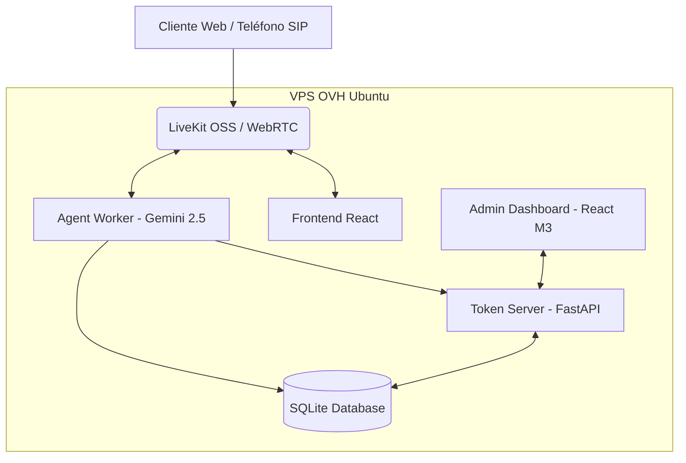

# MSB LiveKit Voice Assistant & Restaurant Management System

Sistema de Asistente de Voz en tiempo real impulsado por **Gemini 2.5 Flash Native Audio** y el **SDK de Agentes LiveKit v1.4.3**.

Este proyecto se ha transformado en un sistema completo de gestión de reservas de restaurantes, que incluye un agente de voz multimodal (que escucha, piensa y habla en tiempo real) y un Dashboard de administración completo.

## Arquitectura del Sistema



## Stack Tecnológico

| Capa | Tecnología |
|-------|-----------|
| **Frontend Público** | React 18 + Vite 5 + LiveKit Components |
| **Dashboard Admin** | React 19 + Vite 6 + Material UI (M3) + React Router |
| **API REST & Token Server** | FastAPI + Uvicorn + Pydantic |
| **Worker IA** | `livekit-agents` 1.4.3 + Python 3.11 |
| **Pipeline de Voz** | `gemini-2.5-flash-native-audio-latest` (STT + LLM + TTS) |
| **Base de Datos** | SQLite3 (`journal_mode=WAL`) |
| **Infraestructura** | VPS OVH + LiveKit OSS (Self-Hosted) + Nginx Proxy |

## Estructura del Proyecto

```text
LIVEKIT/
├── agent/
│   ├── agent.py           # Agente conversacional e integraciones con llm.function_tool
│   ├── database.py        # Esquema y consultas SQLite (mesas, reservas, historial)
│   ├── server.py          # Servidor Token FastAPI + API REST del Dashboard
│   └── restaurant.db      # Base de datos persistente (autogenerada)
├── frontend/
│   ├── src/               # Aplicación React pública para interactuar por voz (WebRTC)
│   └── vite.config.js     
├── dashboard/
│   ├── src/
│   │   ├── pages/         # Vistas M3 (Dashboard, Reservations, Tables, Calls, Settings)
│   │   └── api.ts         # Cliente Axios contra FastAPI
│   └── vite.config.ts     # Configurado con base='/admin/'
└── README.md
```

## Características Principales

### 🍽️ Motor de Reservas Inteligente
- Base de datos relacional con mesas, horarios y disponibilidad estricta.
- El modelo Gemini evalúa solapamientos y reglas de negocio dinámicamente.
- CRUD completo accesible tanto por voz (IA) como por interfaz (Dashboard).

### 🎙️ IA Telefónica Multimodal
- STT (Speech-to-Text) y TTS (Text-to-Speech) de ultrabaja latencia a través de WebSocket.
- Herramientas inyectadas nativamente: `check_availability`, `create_reservation`, `cancel_reservation`, `get_restaurant_info`, `find_reservations`.
- Personalidad configurada vía *System Prompt* dinámico que bebe de la configuración de la BBDD.

### 📊 Dashboard Material Design 3
- Panel de control responsivo servido en `/admin/`.
- Visión general en tiempo real (Mesas ocupadas, cancelaciones, comensales).
- Historial exhaustivo de interacciones de IA (duración, transcripciones, resoluciones).

## Despliegue en Producción (Self-Hosted)

El sistema está desplegado en un entorno VPS Ubuntu usando **LiveKit Open Source** (sin comisiones por nube). Nginx hace de proxy inverso para unificar los servicios bajo el puerto 443 (SSL/TLS).

### Reglas de Nginx:
- `/` -> Frontend React de voz.
- `/admin/` -> Dashboard React de gestión.
- `/api/` -> FastAPI (Generación JWT y Endpoints REST).
- `/rtc`, `/twirp`, `/agent` -> Backend nativo de LiveKit Server (puerto 7880).

**Servicios Systemd:**
- `livekit-server`: Proxy FastAPI + Token.
- `livekit-agent`: Python Worker conectado a Gemini de Google.
- *(El servidor LiveKit OSS corre en contenedores Docker locales)*.

## Variables de Entorno y Secretos

Es obligatorio definir:
- `LIVEKIT_URL`, `LIVEKIT_API_KEY`, `LIVEKIT_API_SECRET`
- `GOOGLE_API_KEY` (Gemini)

## Licencia

Desarrollo privado — MSB Solutions © 2026. Cumpliendo con el protocolo OpenSpec.
